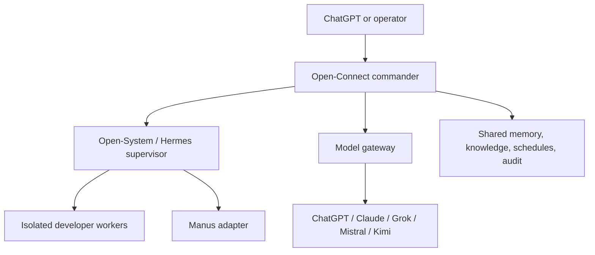

# Open-Connect AI Agent Collaboration

Open-Connect is the single command and policy plane. It does not pretend that consumer chat sessions can be remotely controlled. Each external agent must expose an authorized API, MCP server, or compatible endpoint.

## Canonical names

- Plugin/control plane: `open-connect`
- Skill: `open-connect-agent`
- Toolkit: `open-connect-agentkit`

## Provider status meanings

- `ready`: endpoint and server-side credential reference validated.
- `authorization_required`: owner must complete provider OAuth or supply an API credential to Open-Secret.
- `endpoint_required`: provider needs a supported API/MCP endpoint; browser-login automation is not a substitute.
- `disabled`: deliberately unavailable by policy.

## Shared workflow

Every task uses one project/task identity, context references, correlation ID, environment, policy decision, execution evidence, review result, and memory writeback. Low-risk scheduled work may run unattended. Production and destructive operations always pause for explicit approval.

## Deployment order

1. Apply the Supabase migrations and verify RLS.
2. Configure Open-Secret credential references per provider and environment.
3. Deploy the control API and Open-System/Hermes endpoint to staging.
4. Register the MCP endpoint with supported clients.
5. Validate each provider independently, then run a three-agent staging task.
6. Enable schedules only after retry, idempotency, budget, and kill-switch tests pass.
